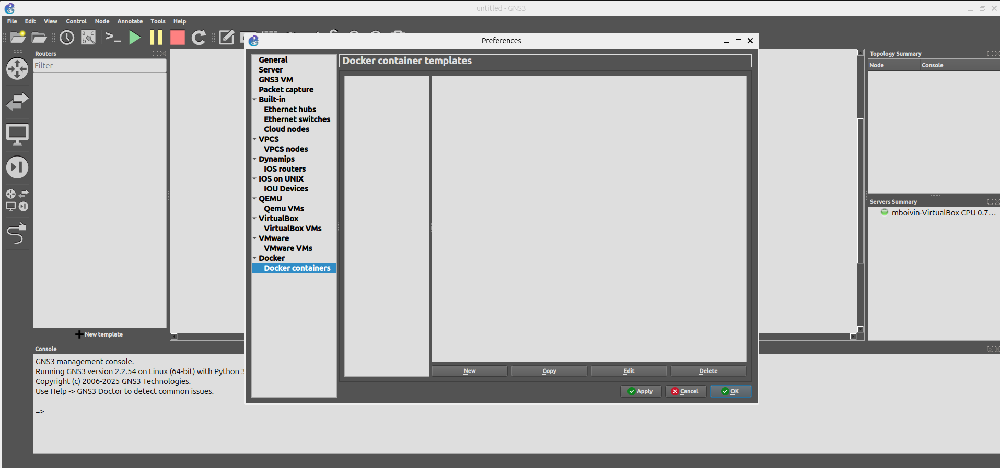
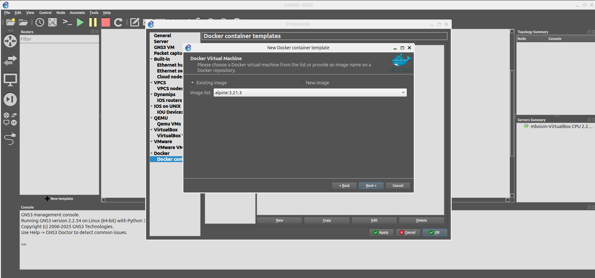
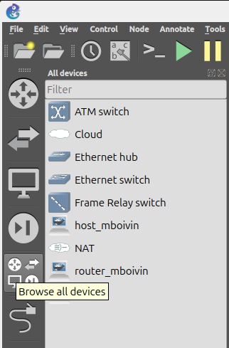
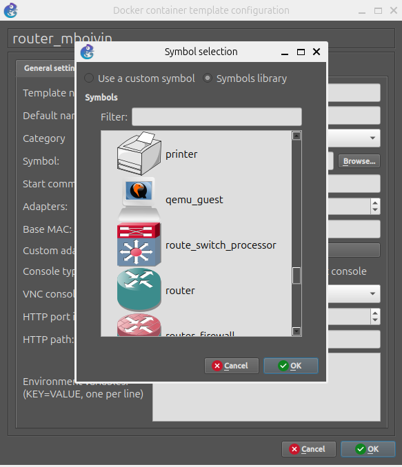

# Partie 1

La première partie du projet est une **introduction au simulateur GNS3**. On doit configurer un environnement de travail dans une machine virtuelle Linux.

Nous verrons comment importer des images Docker dans GNS3 et comment configurer les daemons dans **FRRouting** (fichier `/etc/frr/daemons`) pour faire tourner les services demandés.

## Table des matières

- [Pré-requis](#pré-requis)
- [Tutoriel](#tutoriel)
    1. [Télécharger les images Docker](#1-télécharger-les-images-docker)
    2. [Configurer GNS3](#2-configurer-gns3)
    3. [Créer le réseau](#3-créer-le-réseau)
    4. [Sauvegarder le projet](#4-sauvegarder-le-projet)
- [Soutenance](#soutenance)
- [Ressources](#ressources)

## Pré-requis

Le projet se fait dans une machine virtuelle Linux dans laquelle il faut installer :

- GNS3
- Docker

Suivez ce guide : [GNS3 Linux Install](https://docs.gns3.com/docs/getting-started/installation/linux/).

## Tutoriel

### 1. Télécharger les images Docker

Les conteneurs **Docker** sont utilisés comme des machines virtuelles légères. Ce n'est **pas** un cas d'usage pour de la **production**.

1. Télécharger l'image Docker du routeur :

   ```sh
   $ docker pull frrouting/frr:v8.4.0
   ```

   **FRRouting** est un projet réseau open-source contenant tout ce qui est nécessaire pour compléter le projet.

   Télécharger l'image Docker de l'hôte :

   ```sh
   $ docker pull alpine:3.21.3
   ```

### 2. Configurer GNS3

1. Démarrez GNS3.

2. Créez un nouveau projet nommé `P1` comme demandé dans le sujet.

3. Ajoutez les **templates Docker** à GNS3. Dans la barre de menu, cliquez sur `Edit` > `Preferences`. Une nouvelle fenêtre s'ouvre. Dans le menu de gauche, sélectionnez `Docker containers`.

   

4. Cliquez sur `Nouveau` et sélectionnez l'image Alpine dans la liste.

   

   Configurez le template. Nommez-le avec votre identifiant 42 comme suit : `host_<username>`. Comme il s'agit d'un hôte, il n'a théoriquement besoin que d'un seul adaptateur réseau. Toutefois, définissez-en 2 par défaut pour les besoins du sujet.

5. Répétez l'opération avec l'image du routeur. Nommez-le : `router_<username>`.

6. Continuons à configurer les templates. Affichez les équipements disponibles en cliquant sur les icônes dans le menu de gauche :

   

   Le routeur ne ressemble pas à un routeur. Faites un clic droit dessus, sélectionnez `Configure template`, trouvez le champ `Symbol` et choisissez l'icône demandée dans le sujet.

   

### 3. Créer le réseau

1. Depuis la liste des équipements, glissez-déposez l'hôte Alpine et le routeur. Faites un clic droit sur le routeur, sélectionnez `Configurer` et retirez le suffixe `-<N>` pour respecter le sujet.

2. Démarrez le routeur dans la topologie et ouvrez une console auxiliaire en faisant un clic droit sur l'icône, puis `Console auxiliaire`. Le sujet demande :
     - Le service BGPD actif et configuré.
     - Le service OSPFD actif et configuré.
     - Un moteur de routage IS-IS.

   Pour cela, activez les daemons dans le fichier `/etc/frr/daemons`. **La documentation officielle de FRR explique le fichier [ici](https://docs.frrouting.org/en/latest/setup.html).**

   Ouvrez le fichier avec un éditeur comme `vi`. Modifiez les valeurs de `bgpd`, `ospfd` et `isisd` de `no` à `yes`.

   Activez aussi `vtysh_enable` à `yes` pour que `vtysh` applique la configuration au démarrage des daemons.

3. Démarrez l'hôte dans la topologie.

4. Ouvrez la console auxiliaire des deux machines et exécutez `ps` pour vérifier que la sortie correspond à celle demandée.

### 4. Sauvegarder le projet

Les modifications ne sont pas persistantes. Sauvegardez le fichier `/etc/frr/daemons`.

Le projet doit être exporté en archive ZIP. Dans la barre de menu, cliquez sur `File` > `Export portable project`. Incluez les images de base comme demandé.

## Soutenance

Le [répertoire `docker`](/docker/) contient un Dockerfile pour le routeur avec le fichier des daemons configuré, avec comme image de base celle de FRR.

Depuis la racine du projet :

```sh
$ docker build -t router_mboivin docker
```

## Ressources

- [🎥 GNS3: FRRouting Using Docker Platform](https://www.youtube.com/watch?v=D4nk5VSUelg)
- [GNS3: Docker support in GNS3](https://docs.gns3.com/docs/emulators/docker-support-in-gns3/)
- [FRR: VTYSH](https://docs.frrouting.org/projects/dev-guide/en/latest/vtysh.html)
- [FRR: Basic Setup](https://docs.frrouting.org/en/latest/setup.html)
